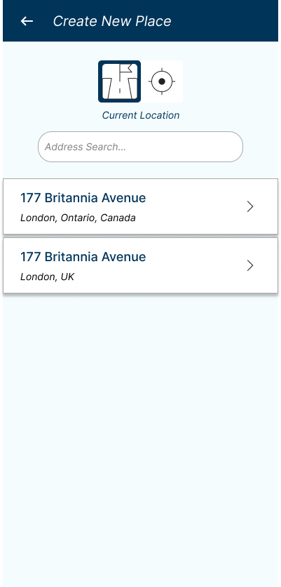

# PaLuv

Creating an Android app to store favourite locations.

## Features

- Add a location with a name and a description
- View all locations
- View a location on a map
- Edit a location
- Delete a location

## Technologies

- Android Studio
- Kotlin
- Google Maps API
- Room Database
- Retrofit
- MVVM Architecture

## Screenshots of Design

### Home Screen

### Add Location

### Detail Location Model

### Location List Screen

### Profile Screen

### Sign Up Screen

### Sign In Screen

